<!--
  GitHub profile README — Richard Victor (rvalves10)
  Concept: terminal / engineering build-log. Minimalist, dark, Python accents.
  TO FINISH: replace SEU-USUARIO in the LinkedIn link (search for "SEU-USUARIO").
-->

<div align="center">
  
</div>

<div align="center">
  <a href="https://richardvictor.dev">
    
  </a>
</div>

<div align="center">
  
  
  
</div>

<br>

## ~$ whoami

21-year-old developer from Sorocaba, Brazil, focused on **backend** and **AI**. I run **Trama Digital**, a small web studio, and I build projects end-to-end — from the first line of code to the deploy. Right now I'm sharpening my backend foundations and my English, with one clear target: writing software that reaches the world.

<details>
<summary><b>Português</b></summary>
<br>
Desenvolvedor de 21 anos, de Sorocaba. Foco em <b>backend</b> e <b>IA</b>. Toco a <b>Trama Digital</b>, um estúdio web, e construo projetos do zero ao deploy. Hoje estou reforçando minha base de backend e o inglês, com um objetivo claro: criar software que chega no mundo todo.
</details>

<br>

## ~$ cat focus.md

```diff
+ Building my portfolio          → richardvictor.dev
+ Backend track (Python, APIs)   → studying via Alura
+ Selected for                   → Santander Bootcamp 2026
+ Leveling up English            → aiming at international roles
```

<br>

## ~$ ls stack/

**Core**  


**Frontend**  


**Backend & AI**  


**Tools**  


`> learning:`  

<br>

## ~$ ./projects --featured

> **Fuel & Brew** — protein-coffee brand landing page  
> An experiment in pushing the front-end to its limits: GSAP timelines, Web Audio API, a canvas particle system, magnetic buttons, custom cursor and 3D tilt.  
> `GSAP` · `Web Audio API` · `Canvas` — [view ↗](https://richardvictor.dev)

> **Ecoo Food** — B2B2C food-waste platform  
> Connecting companies, NGOs and volunteers to cut food waste. AI-powered Smart Match, a glassmorphism design system and ESG dashboards across three user roles.  
> `React` · `Design System` · `AI Match` — [view ↗](https://richardvictor.dev)

> **DevLingo** — gamified programming learning (a "Duolingo for code")  
> Streaks, XP, lives, a visual loop simulator and a Socratic AI tutor that never hands you the answer. Frontend on React + Vite, backend on Node + Express with the Anthropic SDK.  
> `React` · `Node/Express` · `Anthropic SDK` — [view ↗](https://richardvictor.dev)

<sub>More live at <a href="https://richardvictor.dev"><b>richardvictor.dev</b></a></sub>

<br>

## ~$ git --stat

<div align="center">
  
  
</div>

<div align="center">
  
</div>

<br>

## ~$ ./connect

<div align="center">
  <a href="https://richardvictor.dev"></a>
  <a href="https://linkedin.com/in/richardvictor-dev"></a>
  <a href="mailto:richardvic12@gmail.com"></a>
  <a href="https://github.com/rvalves10"></a>
</div>

<br>

<div align="center">
  <sub><code>~$ exit 0</code> — thanks for stopping by. Everything here was built from scratch.</sub>
</div>
